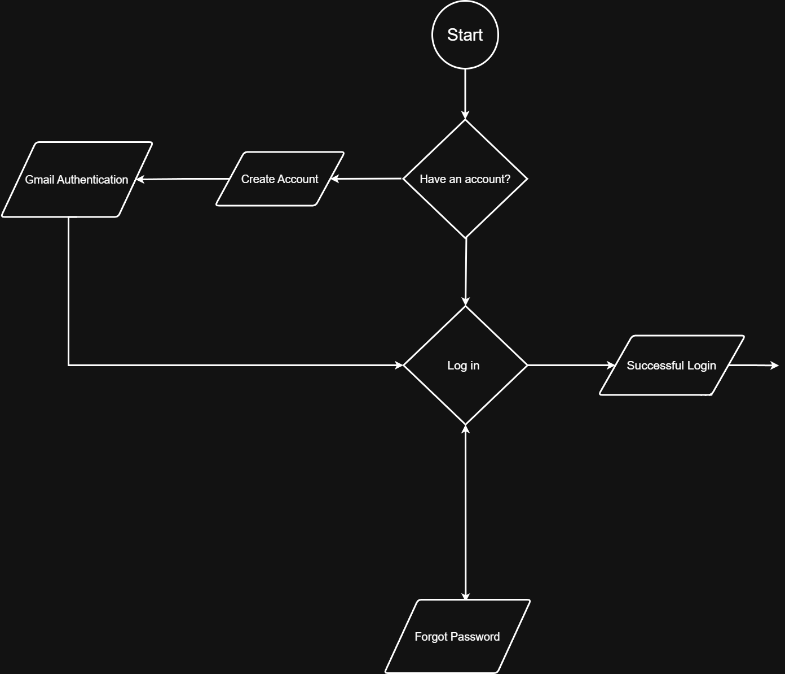
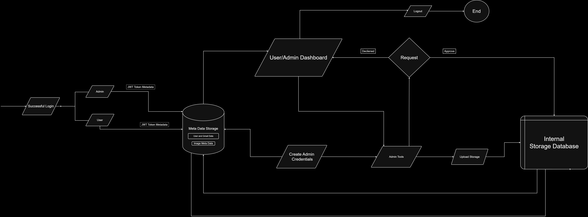

# Imagle

Imagle is a full-stack web application designed for secure internal image access management. It enables users to search, request, and download images after approval, while providing admins with tools to manage uploads, review requests, and oversee system analytics.

---

## Features

### User
- Sign Up & Login (with OTP verification)
- Persistent Login using JWT
- Search images by tags
- Add to Cart
- Send image request to admin
- Download approved images (one-time zip)
- View request/download history
- Dark mode toggle
- Profile dropdown with logout

### Admin
- Protected admin login with credentials
- Role-based access control via JWT
- Upload images with tags
- View and edit uploaded images
- Approve or reject user requests
- Insights Dashboard: view charts, export Excel, and manage admins
- Switch back to user panel from admin view

---

## Tech Stack

| Layer       | Technologies Used                                           |
|------------|-------------------------------------------------------------|
| Frontend   | ReactJS, Bootstrap, Framer Motion, React Router             |
| Backend    | Node.js, Express.js                                         |
| Database   | MongoDB (Admin/User/Image metadata)                         |
| Auth       | JSON Web Token (JWT), OTP Verification                      |
| Storage    | Local folder (Image Storage), ZIP Compression               |
| Utilities  | Axios, Chart.js                                             |

---

## Authentication & Admin Handling

### JWT Authentication
- JWT stores `{ username, role }` payload.
- Tokens are stored in `localStorage` for persistent sessions.
- Auto-role detection (Admin/User) post login.

### Admin Credentials
- Stored securely in MongoDB.
- Passwords hashed before saving.
- Admin creation only by existing logged-in admins via dashboard.

---

## Project Flow

### User Authentication Flow

### User/Admin Dashboard Flow

---

# 📘 Imagle - Complete API Documentation (Frontend + Backend)

---

## 🛠️ Backend API Endpoints

| Method | Path                    | File                  | Purpose                                              |
|--------|-------------------------|-----------------------|------------------------------------------------------|
| POST   | `/login`                | `adminRoutes.js`      | Authenticate a user or admin and return JWT.         |
| POST   | `/create`               | `adminRoutes.js`      | Create a new admin account (admin-only).             |
| POST   | `/logout`               | `adminRoutes.js`      | Logs out the current user (handled client-side).     |
| POST   | `/add`                  | `adminRoutes.js`      | Upload image(s) with tags (admin dashboard).         |
| GET    | `/analytics`           | `adminRoutes.js`      | Fetch admin dashboard analytics and logs.            |
| POST   | `/upload`              | `adminUploadRoutes.js`| Upload image(s) with tags (admin dashboard).         |
| POST   | `/signup`              | `auth.js`             | Register a new user account                          |
| POST   | `/login`               | `auth.js`             | Authenticate a user or admin and return JWT.         |
| POST   | `/upload`              | `imageRoutes.js`      | Upload image(s) with tags (admin dashboard).         |
| PUT    | `/update-tags/:id`     | `imageRoutes.js`      | Update tags of an uploaded image                     |
| GET    | `/`                    | `imageRoutes.js`      | Get all uploaded images                              |
| GET    | `/search`              | `imageRoutes.js`      | Search images by tags or filename                    |
| DELETE | `/api/images/:id`      | `imageRoutes.js`      | Delete an image by ID                                |
| POST   | `/send`                | `otpRoutes.js`        | Send OTP to email                                    |
| POST   | `/verify`              | `otpRoutes.js`        | Verify OTP code                                      |
| POST   | `/`                    | `requestRoutesLocal.js`| Submit new image request                            |
| GET    | `/`                    | `requestRoutesLocal.js`| Fetch all image requests                            |
| PUT    | `/:id`                 | `requestRoutesLocal.js`| Update request status (approve/reject)              |
| GET    | `/export`             | `requestRoutesLocal.js`| Export request data (likely Excel)                  |
| POST   | `/send`                | `RouteForgotPassword.js`| Send OTP for password recovery                     |
| POST   | `/verify`              | `RouteForgotPassword.js`| Verify OTP for password recovery                   |
| POST   | `/reset`               | `RouteForgotPassword.js`| Reset password with new credentials                |

---

## 🎨 Frontend API Calls

| Method | Path                                               | File              | Purpose                                                |
|--------|----------------------------------------------------|-------------------|--------------------------------------------------------|
| POST   | `http://localhost:5000/api/images/upload`          | `AdminUpload.js`  | Upload image(s) with tag info from admin dashboard.    |
| POST   | `/api/requests`                                    | `ContextCart.js`  | Send image download request to admin.                  |
| GET    | `/api/images/search?q=${query}`                    | `ImageSearch.js`  | Search images by tags or filenames.                    |
| GET    | `/api/requests`                                    | `AdminDashboard.js`| Fetch request list or approved images.               |
| POST   | `/api/images/upload`                               | `AdminDashboard.js`| Upload image(s) with tag info from admin dashboard.  |
| GET    | `/api/admins/analytics`                            | `AdminDashboard.js`| Get admin analytics data.                            |
| GET    | `/api/images`                                      | `AdminDashboard.js`| Fetch all uploaded images.                           |
| POST   | `/api/admins/add`                                  | `AdminDashboard.js`| Add new admin (admin-only).                          |
| POST   | `http://localhost:5000/api/images/upload`          | `AdminUpload.js`  | Upload image(s) with tag info from admin dashboard.    |
| POST   | `http://localhost:5000/api/forgot-password/verify` | `ForgotPassword.js`| Verify OTP for password reset                        |
| POST   | `http://localhost:5000/api/forgot-password/reset`  | `ForgotPassword.js`| Reset password using verified OTP                    |
| POST   | `http://localhost:5000/api/auth/login`             | `Login.js`         | Login the user/admin and store JWT token.             |
| POST   | `http://localhost:5000/api/otp/send`               | `Signup.js`        | Send OTP during user registration                     |
| POST   | `http://localhost:5000/api/otp/verify`             | `Signup.js`        | Verify OTP entered by user                            |
| POST   | `http://localhost:5000/api/auth/signup`            | `Signup.js`        | Complete user signup after OTP verification           |
| GET    | `/api/requests`                                    | `UserDashboard.js` | Fetch request list or approved images.                |

---

> ℹ️ All protected routes require the `Authorization: Bearer <JWT_TOKEN>` header.
